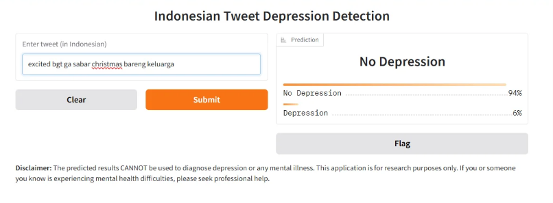
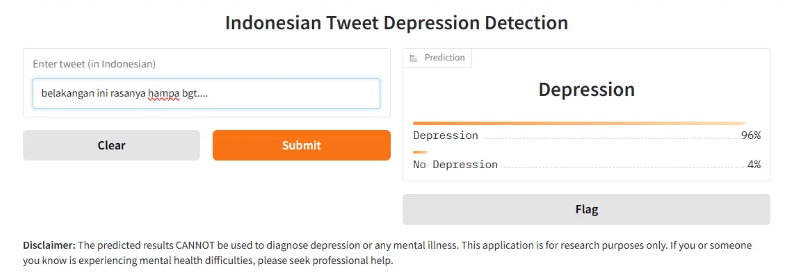

# Indonesian Tweet Depression Detection using Knowledge Distillation

This project was completed for a NLP-course class project. The project focuses on detecting depressive content in Indonesian tweets using transformer-based language models and knowledge distillation.

The system compares multiple transformer models and deploys the best-performing model for depressive tweet classification.

---

# Overview

The project aims to classify Indonesian tweets into:

- Depression (1)
- Non-Depression / Control (0)

The implementation includes:

- Tweet preprocessing
- Transformer-based classification
- Teacher–student knowledge distillation
- Model evaluation
- Gradio deployment

---

# Models Used

The following pre-trained language models were evaluated:

- IndoBERTweet
- IndoBERT
- mBERT

The best-performing model was selected as the teacher model for the knowledge distillation process.

---

# Dataset

Two datasets were used:

## 1. Depression Dataset

Custom Indonesian tweet dataset collected through Twitter crawling using keywords related to depressive emotions such as:

- depresi
- sedih
- stress
- capek

Tweets were manually labeled into:
- 1 → Depression
- 0 → Non-Depression

---

## 2. Meisa's Indonesian Twitter Emotion Dataset

Used as the teacher-training dataset.

Original emotion labels were converted into binary labels:

| Emotion | Converted Label |
|---|---|
| sadness | 1 |
| fear | 1 |
| anger | 1 |
| happy | 0 |
| love | 0 |

Dataset source:

https://github.com/meisaputri21/Indonesian-Twitter-Emotion-Dataset

---

# Preprocessing

Both datasets undergo preprocessing including:

- URL removal
- Mention removal
- Number removal
- Lowercasing
- Whitespace normalization
- Hashtag normalization

---

# Knowledge Distillation

The teacher model is trained using Meisa’s dataset.

The student model is then trained using:
- ground-truth labels
- teacher logits

Loss functions:
- Cross-Entropy Loss
- KL Divergence Loss

---

# Evaluation Metrics

The model is evaluated using:

- Accuracy
- Precision
- Recall
- F1-score
- Confusion Matrix

---

# Final Results

| Metric | Score |
|---|---|
| Accuracy | 84.22% |
| Weighted Precision | 85.32% |
| Weighted Recall | 84.22% |
| Weighted F1-score | 84.42% |

## Depression Class

| Metric | Score |
|---|---|
| Precision | 0.92 |
| Recall | 0.82 |
| F1-score | 0.87 |

---

# Deployment

The final model is deployed using Gradio for interactive prediction.

The system outputs:
- Predicted class
- Prediction confidence score

---

# Disclaimer

This project is intended for:
- Educational purposes
- Research purposes
- Early screening assistance

The model cannot diagnose depression or mental illness and should not replace professional medical or psychological evaluation.

---

# Future Improvements

Potential improvements include:

- Larger datasets
- Sarcasm detection
- Context-aware classification
- Multimodal mental health detection

---

# Author

Developed as a university project on Indonesian tweet depression detection using NLP and transformer models.
